# Omi Wrapped - Your Personalized AI Mentor, Wrapped Daily.

```mermaid
graph LR
    A[Omi Device] -- "Conversation Audio & Transcript" --> B(Omi Backend)
    B -- "Memory Creation Event & Payload (JSON)" --> C{Memory Creation Webhook}
    C -- "Raw Memory Data (JSON Payload)" --> D[(Firestore - `raw_memories`)]
    D -- "Daily Raw Memory Data" --> F[Daily Processing Job]
    E(Cloud Scheduler) -- "Trigger (Daily at 9 PM PT)" --> F
    F -- "Aggregated Transcript Text" --> G{OpenAI API}
    G -- "Processed Reflection Data" --> F
    F -- "Structured Reflection Data" --> H[(Firestore - `daily_reflections`)]
    H -- "Processed Reflection Data" --> J{API Endpoint - `/get_reflection`}
    I[Web App Frontend] -- "Request (UID, Date)" --> J
    J -- "Processed Reflection Data" --> I
    I -- "Display Swipeable Stories" --> K[User's Phone Browser]
    B -- "Future Push Notification API" --> L[Push Notification Service]

    subgraph Google Cloud Platform Infrastructure
        C[Cloud Run API Service]
        F[Cloud Function]
        D[(Firestore Database)]
        E[Cloud Scheduler]
        H[(Firestore Database)]
        J[Cloud Run API Service]
    end

    classDef cloudRun fill:#fafa,stroke:#333,stroke-width:1px,stroke-dasharray:5 5
    classDef cloudFunction fill:#f9f,stroke:#333,stroke-width:2px
    classDef firestore fill:#cce,stroke:#333,stroke-width:1px
    classDef frontend fill:#ccf,stroke:#333,stroke-width:2px
    
    class C,J cloudRun
    class F cloudFunction
    class D,H firestore
    class I frontend
```

[]([PROJECT_WEBSITE_URL_HERE])



## ✨  Unlock Daily Insights and Reflection with Omi Daily Wrapped ✨

In our hyper-connected, always-on world, it's incredibly easy to get swept away by the day-to-day rush, leaving little time for meaningful self-reflection and processing the wealth of information we encounter.  We engage in countless conversations, absorb new ideas, and navigate a constant stream of tasks and information.  However, without dedicated reflection, valuable insights, moments of gratitude, and crucial action items can easily slip through the cracks, hindering personal growth, well-being, and productivity.

**Omi Daily Wrapped** elegantly addresses this critical need. This innovative application, designed for the Omi wearable AI ecosystem, acts as your **Personalized AI Mentor, Wrapped Daily.** It automatically transforms your daily Omi conversations into a beautifully curated and insightful reflection experience, delivered in a familiar and engaging "story" format.

Imagine having a dedicated AI companion that quietly listens, intelligently analyzes, and then presents you with a personalized "daily digest" of your life – every single day.  That's the power of Omi Daily Wrapped.

**Stop letting your day's valuable moments and insights fade away. Start reflecting, learning, and growing effortlessly with Omi Daily Wrapped.**

## Key Features: Your Daily Dose of AI-Powered Reflection

Omi Daily Wrapped is packed with features designed to make daily reflection insightful, actionable, and even enjoyable:

*   **🌅 Daily "Wrapped" Stories: A Visually Engaging Reflection Experience:**  Forget dry lists and tedious reports! Omi Daily Wrapped presents your personalized daily reflection as a series of visually stunning, swipeable "stories," directly inspired by the engaging formats of Instagram Stories and Spotify Wrapped.  Each key aspect of your day is presented on a dedicated slide, creating a fluid and captivating user experience that encourages consistent daily engagement.

*   **🙏 Gratitude Journal Slide: Cultivate Positivity and Appreciation:**  Start your reflection on a high note! This slide automatically identifies and highlights **2-3 specific, genuine moments of gratitude** gleaned from your day's conversations.  Whether it's a kind word from a colleague, a personal accomplishment, or a beautiful moment observed, Omi Daily Wrapped helps you consciously recognize and appreciate the positive aspects of your day, fostering a more optimistic and thankful mindset.

*   **🧠 Knowledge Gap Filled Slide: Turn Conversations into Learning Opportunities:**  Unlock the hidden learning potential within your daily interactions. This slide intelligently extracts and presents **key jargon, technical terms, unique concepts, or even names of people or places you encountered in your conversations.**  For each term, Omi Daily Wrapped provides a concise, AI-generated definition or context, acting as your personal knowledge refresher and helping you solidify new information absorbed throughout the day.  This turns everyday conversations into continuous learning experiences.

*   **✨ "It's the Little Things" Slide: Nudge Actions from Subtle Cues:**  Life is in the details! This slide highlights **2-4 subtle but potentially important observations** gleaned from your conversations – those "little things" that might otherwise be missed but could lead to meaningful actions. Examples include mentions of preferences ("Joey likes donuts"), needs ("Running low on printer ink"), or emerging opportunities.  For each "little thing," Omi Daily Wrapped intelligently suggests a concise, actionable next step, prompting you to be more thoughtful and responsive in your daily life.  *These suggested actions are also subtly incorporated into your Task List for easy follow-up.*

*   **🦉 Omi Mentor Advice Slide: Personalized Guidance for Continuous Improvement:**  Receive direct, personalized mentorship from your AI companion!  This slide delivers a **single, constructive, and highly relevant piece of advice** generated by the AI, specifically tailored to the themes and patterns observed in your day's conversations.  This advice focuses on key areas like communication effectiveness, productivity strategies, goal alignment, and overall well-being, providing gentle nudges towards continuous personal and professional growth.

*   **✅ Interactive Task List Slide: Actionable Insights at Your Fingertips:**  Reflection isn't just about insights – it's about action! The final "Task List" slide consolidates all the actionable outputs from your Daily Wrapped experience. It presents a **scrollable, interactive checklist** containing:
    *   **Direct Action Items:**  Explicit tasks and to-dos mentioned directly in your conversations.
    *   **Suggested Actions (from "Little Things"):**  Intelligent suggestions derived from subtle cues in your conversations.
    Each task item features a **checkbox**, allowing you to easily curate your to-do list by including or excluding items as needed.  A prominent **"Copy Selected Tasks" button** at the bottom enables instant export of your chosen action items.

*   **📋 Copy to Clipboard Functionality: Seamless Integration with Your Workflow:**  Take immediate action on your reflections! The "Copy Selected Tasks" button, when tapped, instantly copies your chosen action items to your device's clipboard. The tasks are formatted as a clean, **markdown-compatible list**, ready to be pasted directly into your favorite task management tools like **Notion, Todoist, Google Tasks**, or any text-based list.  A confirmation modal with direct links to Notion and Todoist further streamlines your workflow.

*   **☁️ Robust and Scalable GCP Cloud Backend:**  Built on the надежная and scalable Google Cloud Platform, Omi Daily Wrapped ensures reliability and performance.  The backend leverages:
    *   **Cloud Run:**  For the core API service, handling webhook data ingestion and serving processed reflections.
    *   **Cloud Functions:** For the automated nightly processing job, triggered by Cloud Scheduler.
    *   **Firestore:** As a NoSQL database for efficient storage and retrieval of both raw conversation data and processed reflection results.
    *   **Cloud Storage:**  For cost-effective and globally accessible hosting of the static web application frontend.
    *   **Cloud Scheduler:**  For automated, time-based triggering of the daily reflection processing.

*   **🧠 Powered by OpenAI API: Intelligent Conversation Analysis:**  At the heart of Omi Daily Wrapped lies the power of the OpenAI API.  Leveraging advanced models like `gpt-3.5-turbo-0125`, the application intelligently analyzes your daily conversation transcripts to:
    *   Identify key themes and sentiments.
    *   Extract moments of gratitude and positivity.
    *   Pinpoint new terms and concepts for knowledge reinforcement.
    *   Infer subtle cues for actionable suggestions.
    *   Generate concise and helpful mentor-like advice.

*   **🔄 Seamless Omi Integration via Webhooks:**  Omi Daily Wrapped integrates effortlessly with the Omi ecosystem through the **Memory Creation Webhook**.  Whenever Omi processes and saves a new conversation memory, your application automatically receives the relevant data in real-time, ensuring timely and up-to-date daily reflections without any manual user intervention required for data synchronization. Access to your Daily Wrapped reflection is then conveniently provided through the **Omi App Home URL**, launching the visually engaging web application directly from within the Omi mobile environment.

## How to Use: Your Daily Reflection Ritual

Integrating Omi Daily Wrapped into your daily routine is incredibly simple:

1.  **Installation (Effortless Setup):**  (For a real-world app, users would install via the Omi App Store. For this hackathon, assume pre-installed).
2.  **Live Your Day with Omi:**  Simply wear your Omi device and engage in your day as usual.  Omi Daily Wrapped works silently in the background, automatically capturing and processing your conversations.
3.  **Nightly Reflection - Access Your Daily Insights:**  Around [Your Scheduled Time, e.g., 9:00 PM Pacific Time] (or whenever you prefer to reflect on your day):
    *   Open the **Omi mobile app** on your phone.
    *   Navigate to your list of **installed apps**.
    *   **Tap the "Omi Daily Wrapped" app icon.**
    *   Omi will instantly launch your personalized Daily Reflection web application in your device's browser.
4.  **Swipe and Reflect:**  Effortlessly swipe vertically through the beautifully designed story slides, immersing yourself in your daily reflection:
    *   **Intro Slide:**  Set the mood with the daily emoji and summary.
    *   **Gratitude Journal:**  Review and appreciate the positive moments highlighted.
    *   **Knowledge Gap Filled:**  Reinforce your learning by reviewing new terms and definitions.
    *   **It's the Little Things:**  Consider the subtle cues and suggested actions.
    *   **Mentor Advice:**  Absorb the personalized guidance from your AI mentor.
    *   **Task List:**  Review, curate, and copy your action items.
5.  **Copy Action Items to Your Task Manager:**  On the "Task List" slide, review the automatically generated tasks, check the boxes next to the ones you want to act on, and tap the **"Copy Selected Tasks"** button.  Paste the formatted markdown list into Notion, Todoist, or your preferred to-do app to seamlessly integrate your reflection insights into your daily workflow.

**Important Note on Notifications (Proof of Concept Limitation):**

For this Proof of Concept hackathon submission, Omi Daily Wrapped is designed to be accessed on-demand via the **Omi App Home URL**.  Currently, the application **does not implement automatic push notifications** to proactively remind you to view your daily reflection.  While push notifications are a highly desirable feature for future iterations to further enhance user engagement and convenience, the focus for this hackathon has been on building the core reflection engine, the visual story experience, and the seamless data flow.  Exploring and implementing push notifications (potentially via Web Push APIs or future Omi-provided notification channels) remains a key area for future development and enhancement.


## Get Started (For Developers - Replicating this Project)

Ready to build your own personalized Daily Reflection app for Omi? Follow these steps to replicate the project setup and deployment:

**Prerequisites:**

1.  **Google Cloud Platform (GCP) Account:** You'll need a GCP account with billing enabled to deploy and run the backend services (Cloud Run, Cloud Functions, Firestore, Cloud Scheduler, Cloud Storage).  Consider exploring the GCP Free Tier for initial development and testing.
2.  **Google Cloud SDK (gcloud CLI) Installed and Configured:** Ensure you have the `gcloud` command-line tool installed and configured to access your GCP project. See the [official gcloud installation guide](https://cloud.google.com/sdk/docs/install).
3.  **Docker Desktop:** Docker is required to build and push the container image for the Cloud Run API service. Download and install [Docker Desktop](https://www.docker.com/products/docker-desktop/).
4.  **Omi Dev Kit (Optional but Recommended for Full Testing):** While you can develop and test parts of the application without a physical Omi device, having an Omi Dev Kit will allow you to fully test the end-to-end integration with real conversation data and webhook triggers. You can request a Dev Kit through the Omi hackathon channels.
5.  **OpenAI API Key:**  You will need an API key from OpenAI to utilize the GPT-3.5 Turbo model for conversation analysis and content generation. Obtain an API key from the [OpenAI Platform website](https://platform.openai.com/). Ensure you have billing set up for your OpenAI account.
6.  **Notion API Integration (Optional, for Task Export Feature Extension):** While the core POC focuses on clipboard copy for task export, future integration with the Notion API (or other task management APIs) would require creating a Notion Integration and obtaining an API key.  See the [Notion API documentation](https://developers.notion.com/) for details.
7.  **Python 3.10+ and `pip`:** Ensure you have Python 3.10 or a later version installed on your development machine, along with `pip`, the Python package installer.
8.  **VS Code (Recommended IDE):**  While any code editor can be used, VS Code is highly recommended for Python, JavaScript, HTML, and CSS development and provides excellent terminal integration for running `gcloud` and Docker commands.
9.  **Node.js and npm (Optional, for Frontend Dependency Management):** While the frontend dependencies in this POC are included via CDN links for simplicity, for more complex frontend development, you might want to install Node.js and npm (Node Package Manager) to manage JavaScript libraries and potentially use a frontend build toolchain.

**Clone the Repository (GitHub - [YOUR_GITHUB_REPO_URL_HERE]):**

1.  **Clone the GitHub Repository:** If the project code is available on GitHub (replace `[YOUR_GITHUB_REPO_URL_HERE]` with your actual repository URL), clone it to your local machine using Git in your terminal:
    ```bash
    git clone [YOUR_GITHUB_REPO_URL_HERE]
    cd omi-daily-wrapped  # Or the name of your cloned repository folder
```

cd omi-wrapped  # Repository folder name

# Set up environment variables
cat > .env << EOL
OPENAI_API_KEY=your_api_key_here
EOL
```

### Backend Deployment:

#### 1. Deploy the Webhook Collector API (Cloud Run):

```bash
# Navigate to webhook collector directory
cd omi-webhook-collector

# Build and deploy to Cloud Run
docker build -t gcr.io/[YOUR_GCP_PROJECT_ID]/omi-webhook-collector:v1 .
docker push gcr.io/[YOUR_GCP_PROJECT_ID]/omi-webhook-collector:v1
gcloud run deploy omi-webhook-collector --image gcr.io/[YOUR_GCP_PROJECT_ID]/omi-webhook-collector:v1 --platform managed --region us-west2 --allow-unauthenticated
```

**Configure the Webhook in Omi:**
- Take the URL provided by Cloud Run (e.g., `https://omi-webhook-collector-xxxx.a.run.app`)
- In the Omi platform's webhook settings, configure your Memory Creation Webhook to point to this URL 
- Add `/memory_webhook?uid=YOUR_USER_ID` to the end (replace YOUR_USER_ID with your actual Omi User ID)

#### 2. Deploy the Daily Processing Function:

```bash
# Navigate to processor directory
cd ../daily-reflection-processor

# Deploy to Cloud Functions with environment secrets
gcloud functions deploy daily-reflection-processor \
  --runtime python311 \
  --trigger-http \
  --entry-point daily_process_memories \
  --set-env-vars OPENAI_API_KEY=your_openai_key_here \
  --region us-west2 \
  --timeout 540s \
  --memory 256Mi \
  --gen2
```

#### 3. Set Up Cloud Scheduler:

```bash
# Create a daily trigger (9 PM Pacific Time)
gcloud scheduler jobs create http omi-daily-reflection-job \
  --schedule="0 21 * * *" \
  --time-zone="America/Los_Angeles" \
  --uri="https://us-west2-[YOUR_GCP_PROJECT_ID].cloudfunctions.net/daily-reflection-processor" \
  --http-method=GET \
  --location us-west2
```

### Frontend Deployment:

#### 1. Create Cloud Storage Bucket:

```bash
# Create a public bucket for static hosting
gsutil mb -l us-west2 gs://bucket-omi-wrapped
gsutil web set -m index.html gs://bucket-omi-wrapped
gsutil iam ch allUsers:objectViewer gs://bucket-omi-wrapped
```

#### 2. Upload Frontend Files:

```bash
# Navigate to frontend directory
cd ../omi-wrapped-frontend

# Upload files to bucket
gsutil cp index.html gs://bucket-omi-wrapped/
gsutil cp style.css gs://bucket-omi-wrapped/
gsutil cp script.js gs://bucket-omi-wrapped/
```

**Update API Endpoint:**
- Edit `script.js` to update the `API_ENDPOINT` constant with your Cloud Run URL
- Edit `USER_ID` if needed for testing with your specific user ID

## 📱 Usage Examples

**Example Use Case 1: Daily Reflection After Work**
1. Wear Omi throughout your workday, capturing conversations with colleagues
2. At 9:30 PM, receive a reminder to check your daily wrap-up
3. Open Omi app, tap "Omi Wrapped" from the installed apps
4. Swipe through your reflection, observing:
   - A recurring topic about project deadlines (🔄 emoji)
   - Appreciation for a colleague who stepped in to help
   - New terminology: "ADR" (Architecture Decision Record)
   - Action items for tomorrow's team standup
5. Copy your tasks to Notion for tomorrow's planning

**Example Use Case 2: Revisiting Past Days**
1. Tap the calendar icon in Omi Wrapped
2. Select a date from last week
3. View that day's specific reflections, including:
   - Different mood emoji (perhaps 🎯 for a highly focused day)
   - Knowledge gaps filled from that particular day
   - Reminders of specific gratitude moments you might have forgotten

## 🔜 Future Roadmap (Beyond Hackathon)

While the current Proof of Concept delivers a functional and valuable user experience, there are several exciting ways to extend and enhance Omi Wrapped in the future:

1. **Direct Task Integration:** Implement native integrations with Notion, Todoist, and Google Tasks for one-tap task export without clipboard copying.

2. **Voice Playback:** Enable an option to have your daily summary read aloud by Omi, perfect for when you're winding down before bed.

3. **Multimodal Support:** Process not only transcripts but also photos or other data captured via Omi's multimodal capabilities.

4. **Weekly & Monthly Summaries:** Provide zoom-out views that aggregate insights over longer timeframes, similar to "Spotify Wrapped" but on weekly/monthly cadences.

5. **Progress Tracking:** Identify recurring themes, track mood trends, and visualize personal growth over time.

6. **Smart Notifications:** Implement context-aware reminders for the most important action items at optimal times.

## 🙏 Acknowledgments

Special thanks to:

* The Omi team for creating such an innovative platform and organizing this hackathon
* OpenAI for providing the language models that power the reflection insights
* Google Cloud Platform for the reliable infrastructure services
* The Swiper.js team for the elegant story interface components

## 🧩 Technical Details

For developers interested in the technical implementation details:

* **API Documentation**: See `docs/` folder for endpoint specifications and schemas
* **Data Structures**: See `docs/firestore_schema.md` for database design
* **Webhook Format**: Compatible with Omi Memory Creation webhook payloads
* **Cloud Architecture**: See mermaid diagram in the main project description
* **License**: MIT

---

*This project was created for the Omi Hackathon 2025. Feel free to adapt and extend it for your own personal use!*