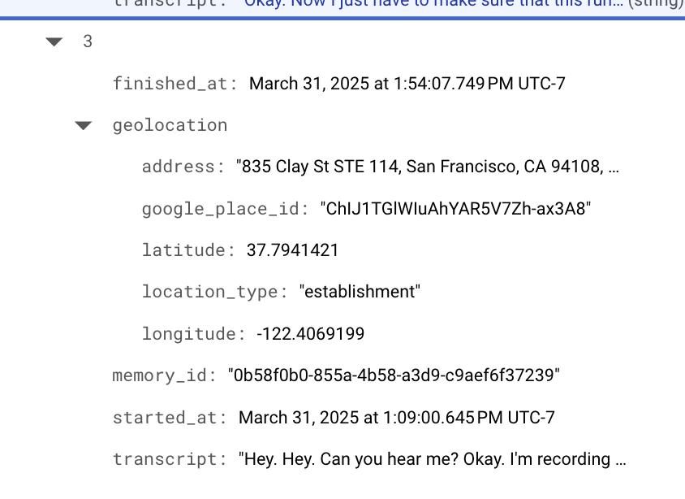

run ngrok https 8080 or whatever uvicorn's port is in main.py then paste that in omi app

https://aistudio.google.com/prompts/15aZzCpMc7jUS60GQdR7GGM2rs3ggZDd3

firestore: https://console.cloud.google.com/firestore/databases/-default-/data/panel/raw_memories/ckVQW3MVAoenlOdYhHLt5K3zPpW2_2025-03-31?authuser=1&invt=AbthxQ&project=omi-mentor-hackathon

woo


todo:
multiple user support for
```
IMPORTANT: Find the line user_id = request.args.get("uid", os.environ.get("TARGET_USER_ID", "YOUR_DEFAULT_TEST_USER_ID")) near the start of the daily_process_memories function. Replace "YOUR_DEFAULT_TEST_USER_ID" with your actual Omi User ID (e.g., ckVQW3MVAoenlOdYhHLt5K3zPpW2) for testing purposes. Later, you could remove this default and rely only on environment variables or request parameters if supporting multiple users.
```

